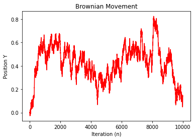

# Finance-Prediction-Python
A data science project for volatility prediction using Brownian motion and Monte-Carlo Simulation

<h3>Brownian Motion:<h3>
$Y_n(t) = \frac{1}{\sqrt{n}}\sum_{k}Z_k -> \text{First Term's formula}$


```python
import numpy as np
import matplotlib.pyplot as plt

#Autor: Ivan Grana

np.random.seed(4)
n = 10**4 #quantidade de iteracoes

SQN = 1/np.math.sqrt(n) # Formula de atualização

Z_valores = np.random.randn(n)
Yk = 0
SB_movimento=list()

for k in range(n):
     Yk = Yk + SQN*Z_valores[k] #Função de atualização da posição da particula
     SB_movimento.append(Yk)
  

plt.plot(SB_movimento,color = "red")
plt.title("Brownian Movement")
plt.ylabel("Position Y")
plt.xlabel("Iteration (n)")
plt.show()
```
 

    
